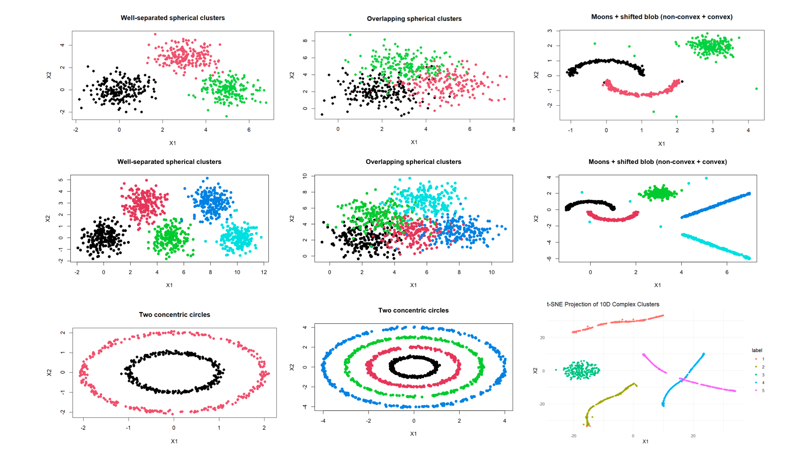
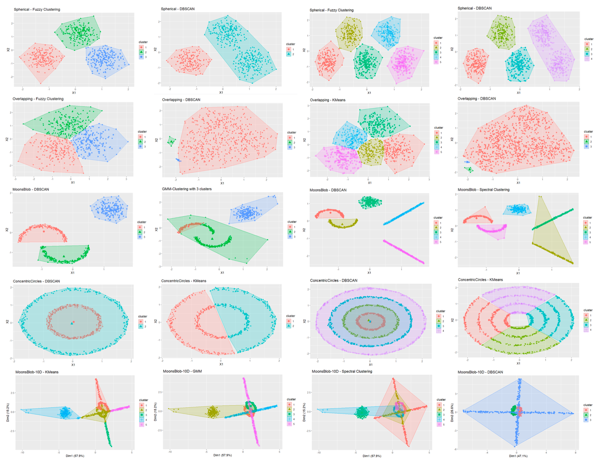

# Clustering Non-Convex Datasets: A Comparative Study Across Hard, Soft, Model-Based, Spectral, and Density-Based Clustering Techniques


This project provides a comprehensive benchmark of five major clustering algorithms by evaluating their performance on various synthetic datasets, including both convex and non-convex structures. The goal is to highlight the strengths and weaknesses of each method and underscore the importance of selecting the right algorithm for different data geometries.


## Table of Contents
- [About the Project](#-about-the-project)
- [Algorithms Compared](#-algorithms-compared)
- [Key Findings](#-key-findings)
- [How to Run](#-how-to-run)
- [Evaluation Metrics](#-evaluation-metrics)
- [Conclusion](#-conclusion)

---

## About the Project

Choosing an appropriate clustering algorithm is a critical step that can significantly impact the quality of results. This project performs a controlled comparison of hard, soft, model-based, spectral, and density-based clustering techniques to test their ability to handle challenges like non-convexity, cluster overlap, and high dimensionality.

We designed several synthetic datasets in 2D with different cluster numbers and 10D to test the algorithms under different conditions, including:
* Well-separated and overlapping spherical clusters
* Non-convex shapes like concentric circles and moons
* A high-dimensional scenario to test scalability

Each simulation was repeated 20 times to ensure robust and reliable results.

---




## Algorithms Compared

We evaluated five algorithms, each representing a different clustering paradigm:

1.  **K-Means**: A classic centroid-based method that partitions data by minimizing within-cluster variance.
2.  **Probabilistic Distance Clustering (PDQ)**: A fuzzy clustering approach that allows points to have membership in multiple clusters, adjusting for cluster size.
3.  **Gaussian Mixture Models (GMM)**: A model-based method assuming data is generated from a mixture of Gaussian distributions.
4.  **Spectral Clustering**: A graph-based method that excels at finding non-convex structures by using the eigenvectors of a similarity matrix.
5.  **DBSCAN**: A density-based method that identifies clusters as high-density regions and can find arbitrarily shaped clusters while labeling outliers as noise.

---

## Key Findings

Our analysis revealed clear performance differences across the algorithms, highlighting that the optimal choice is highly dependent on the dataset's structure.

* **For Non-Convex Shapes** (e.g., concentric circles, moons): **DBSCAN** and **Spectral Clustering** were the top performers, consistently identifying the complex structures where other methods failed. DBSCAN was also extremely fast.
* **For Convex Shapes** (e.g., spherical clusters): **K-Means**, **GMM**, and **PDQ** performed exceptionally well, achieving near-perfect scores on well-separated data.
* **For Overlapping Data**: DBSCAN was the worst performer, often grouping all points into a single cluster. GMM and K-Means handled overlapping clusters better.
* **In High Dimensions (10D)**: **GMM** was the clear winner. The performance of DBSCAN and Spectral Clustering degraded significantly, as their distance-based measures become less effective in high-dimensional space.
* **Most Robust Algorithm**: While never the absolute best, **Spectral Clustering** was the most consistent performer across all scenarios, suggesting robustness in varied situations, though it comes with a high computational cost.


---

## How to Run

1.  **Clone the repository:**
    ```sh
    git clone [https://github.com/your-username/clustering-benchmarking.git](https://github.com/your-username/clustering-benchmarking.git)
    ```
2.  **Open the R Markdown file** (`clustering_analysis.Rmd`) in RStudio.

3.  **Install the required packages:**
    ```R
    install.packages(c("MASS", "mclust", "kernlab", "FPDclustering", "dbscan", "fclust", "cluster", "factoextra", "MixGHD", "aricode", "clusterCrit", "ggplot2", "FNN", "Rtsne"))
    ```
4.  **Run the code chunks** in the R Markdown file to reproduce the simulations and analysis.

---

##  Evaluation Metrics

Algorithm performance was assessed using five external validation metrics that compare the predicted clusters to the true labels:

* **Adjusted Rand Index (ARI)**: Measures the similarity between two clusterings while correcting for chance.
* **Normalized Mutual Information (NMI)**: Quantifies the mutual information between the predicted and true labels.
* **Folkes-Mallows Index (FMI)**: Computes the geometric mean of precision and recall for point pairs.
* **Jaccard Index (JCI)**: Calculates the ratio of correctly clustered pairs to the total number of pairs.
* **Runtime**: Measures the computational efficiency of each algorithm.

---


Example plots showing good and poor clustering results for each dataset under varying cluster settings. Last row shows 10D Moons results using K-means, GMM, Spectral, and DBSCAN (Fuzzy is excluded due to similarity with K-means in this setting

## Conclusion

This study confirms that there is no one-size-fits-all clustering algorithm. The optimal choice depends heavily on the underlying structure of the data. For complex, non-convex shapes, density-based and spectral methods are superior. For simpler, convex data, traditional methods like K-Means and GMM are both effective and efficient. GMM proved most effective in high-dimensional settings. Ultimately, understanding the data's geometry and the specific goals of the analysis are crucial for selecting the best clustering technique.